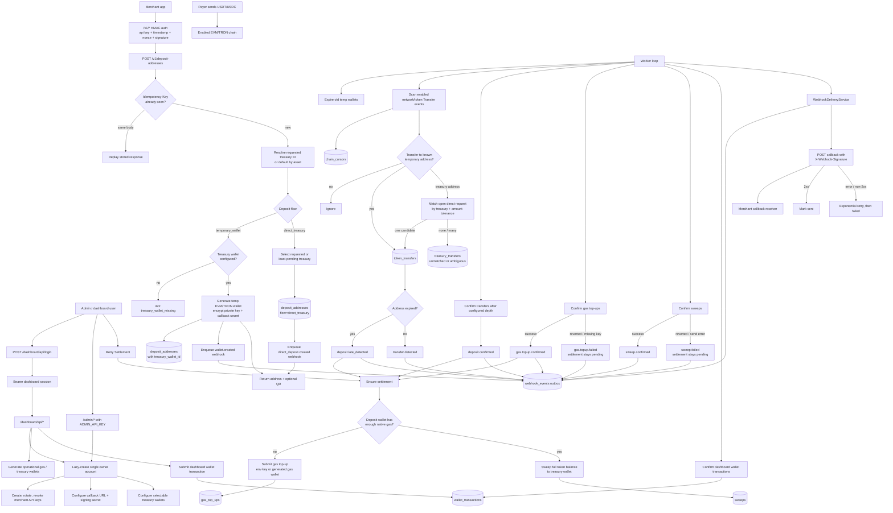
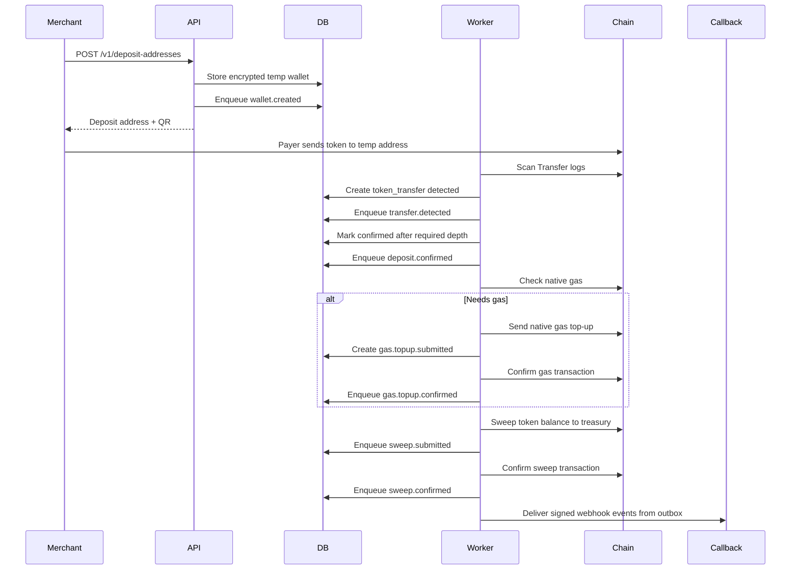
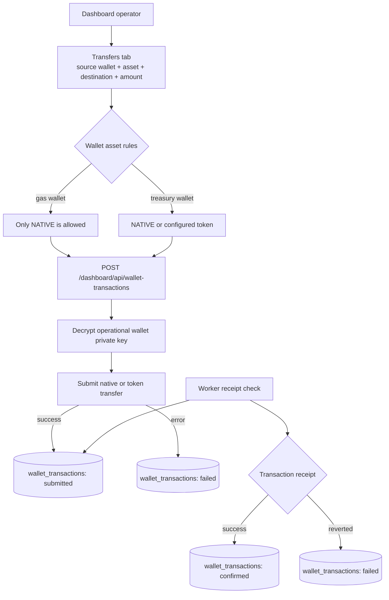

# Application Flows

This document maps the main runtime flows in the gateway: dashboard setup, merchant deposit creation, worker settlement, webhook delivery, and dashboard-submitted wallet transactions.

## End-to-End System Flow



## Normal Deposit Sequence



## Flow Notes

The dashboard and admin API operate on a single internal owner account. The owner account is created lazily when dashboard or admin routes need it. From there, operators create merchant API keys, configure the callback URL and copyable signing secret, configure selectable treasury wallets, generate operational wallets, retry blocked deposit settlement, and submit manual wallet transfers.

Merchant API calls under `/v1/*` require HMAC authentication. The request includes the public API key, timestamp, nonce, and signature. The server rejects stale timestamps, reused nonces, invalid signatures, revoked API keys, and disabled merchants.

`POST /v1/deposit-addresses` is idempotency-aware. If the same `Idempotency-Key` is reused with the same request body, the stored response is replayed. If the same key is reused with a different body, the request is rejected.

Deposit request creation requires a configured treasury wallet for the requested network and token. It also requires an active dashboard callback configuration unless the request supplies both a per-deposit callback URL and secret. The merchant may pass `treasuryWalletId`. For the temporary-wallet flow, the API uses the default treasury when omitted, verifies worker scan settings, chain RPC connectivity, token contract readability, gas wallet configuration, gas top-up sizing, and current gas wallet native balance. If any of those checks fail, the API returns a `422` before creating the temporary wallet; multiple setup issues are returned together as `deposit_configuration_incomplete`. Otherwise, it generates an EVM or TRON temporary wallet, encrypts the private key, stores the public address and selected treasury ID, enqueues `wallet.created`, and returns the public address with optional QR output.

For `direct_treasury`, the API requires `amount`. If `treasuryWalletId` is omitted, it selects the treasury wallet with the fewest active direct requests for that asset. The worker first ignores known internal sweep transactions, then auto-matches a treasury transfer only when exactly one active direct request for the same merchant/network/token/treasury is within the configured tolerance. Out-of-tolerance and ambiguous transfers are stored in `treasury_transfers` for dashboard or merchant API manual matching.

The worker is the settlement state machine. Each tick expires old deposit addresses, scans configured token `Transfer` events, records matching deposits, confirms deposits after the configured block depth, checks native gas, tops up gas when needed, sweeps token balances to treasury, confirms submitted top-ups and sweeps, and confirms dashboard wallet transactions.

Callbacks are not a single callback for the whole deposit. The gateway creates one webhook event per lifecycle step, and each event may have multiple delivery attempts until it is marked `sent` or permanently `failed`.

Common event order for an active deposit:

```text
wallet.created
transfer.detected
deposit.confirmed
gas.topup.submitted        optional
gas.topup.confirmed        optional
sweep.submitted
sweep.confirmed
wallet.expired             later, when the temporary address TTL ends
```

Common event order for a late deposit:

```text
wallet.created
wallet.expired
deposit.late_detected
gas.topup.submitted        optional
gas.topup.confirmed        optional
sweep.submitted
sweep.confirmed
```

## Zero-Gas Behavior

Temporary deposit wallets often receive only tokens and may have `0` native gas. The worker handles that by checking the deposit wallet native balance before sweeping. If the balance is below the configured threshold, it sends a native gas top-up from either:

- the network's configured `GAS_WALLET_PRIVATE_KEY_*` environment key, or
- a generated operational gas wallet stored encrypted in the database.

If the top-up is submitted and later confirmed, the worker retries settlement and submits the token sweep.

For deposits whose gas source is depleted after address creation, or whose top-up transaction fails, the gateway records `gas.topup.failed`, enqueues a callback, and keeps the transfer settlement pending at the gas top-up step. The worker does not automatically create a second attempt after a failed attempt. Recovery is operational but first-class: fund or configure the gas source, then use **Retry Settlement** in the dashboard to create a new gas top-up attempt.

Sweep submission or receipt failures behave the same way: the gateway records `sweep.failed`, sends the callback, keeps settlement pending at the sweep step, and preserves the failed attempt. After the issue is resolved, **Retry Settlement** creates a new sweep attempt.

## Dashboard Wallet Transactions

Dashboard wallet transfers are separate from automatic deposit settlement.


